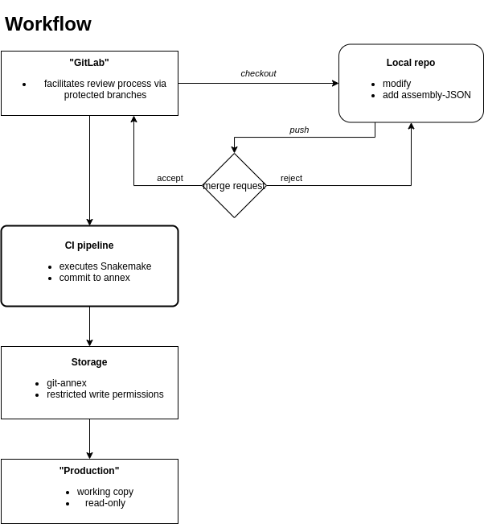

# Reference data 


[](https://snakemake.readthedocs.io)


A snakemake-based pipeline to set up reference genome and corresponding data.

## Concept

Use Snakemake for preparing data in the reference-data repository. 

A versatile `Snakefile` with corresponding wrappers for common tasks generated reference-data. 
The pipeline can be executed locally or on continuous integration infrastructure, 
that automatically commits the generated dataset in centrally stored git-annex repository. 

The data for each genome is stored in `JSON`-files, that is retrieved via the ENSEMBL API. 
### Workflow




### Data management

Datasets created by this pipeline will the follow a four level directory structure with the pattern

`$species/$primary_assembly_variant/$sequence_variant/$snv_variant`

Here, `$species` refers to the scientific name of the organism,
 `$primary_assembly` to the assembly variant provided by public resources, 
 `$naming_variant` to sequence differences created by addition / removal of auxillary sequence (e.g. *PhiX*), and
 `$snv_variant` to variants caused by replacing nucleotides. 
 
For brevity, the levels are also referred to as 1-4.

### Versioning data

Each dataset will be initialized as an own `git` repository so that workflows 
and analyses can always refer to versions of reference data used.


## Configuring the pipeline

A global configuration is stored in `src/config.json`.
This defines the base-directory of the repository and the ENSEMBL version to be used for downloading.
*Note* the ENSEMBL release version used may vary between species/genomes depending on the researches demands. For all annotation files, the release version is part of the filename. 

## Routines

 - [x] Download genome sequence, including CHECKSUM verification 
 - [x] Download annotation, including CHECKSUM verification 
 - [x] Un(g)zip data
 - [x] bwa index 
 - [x] STAR index (not tested)
 - [x] add sequences (e.g. PhiX)        
 - [ ] replace chromosome prefixes
   
## How to run

1. If Snakemake is not installed, create environment
    ```
    conda env create -f workflows/envs/snakemake-base.yml
    conda activate snakemake-base
    ```
2. Configuration
  - Adjust the directories in `config/config.json` .  
 
 -  The pipelines uses a forked version of the snakemake-wrapper repository. In order to ensure reproducibility, change the
     `wrapperdir" and `wrapper_custom_commit` variables to the commit you will be using. For example: 
     ```
    "wrapper_dir": "https://raw.githubusercontent.com/DKFZ-ODCF/snakemake-wrappers",
    "wrapper_custom_commit": "6b32a15a"
    ```
     
4. Request genome-information from ENSEMBL and execute Snakemake
  - Use the handy tool to retrieve the genome of interest from the ENSEMBL REST API (https://rest.ensembl.org/).
    ```bash    
    python workflow/scripts/ensembl_json.py "Sacchromyces cerevisiae" 
    ```

## Snakemake wrappers

Whenever possible, the workflow uses wrapper to externalize tasks. In order to allow some independence from the offical *snakemake-wrappers* repository (LINK)
that provides universally applicable wrappers, we're using a [forked wrappers repository](https://github.com/DKFZ-ODCF/snakemake-wrappers)

## Development

### Testing

#### Gitlab CI

When pushed to Gitlab repository, the pipeline configured in `.gitlab-ci.yml` performs a dry and actual test run using 
the *Sacchromyces cerevisiae* genome. 

#### Github Actions (deprecated)
This repository is using github *actions* for automated testing. The workflow described in `workflows/test.yaml` performs 
a dry run of the pipeline, a run to create a summary report for inspection of the snakemake workflow and a actual test run using 
the *Sacchromyces cerevisiae* genome. 

The test workflow is triggered at each push of the development branch.  
